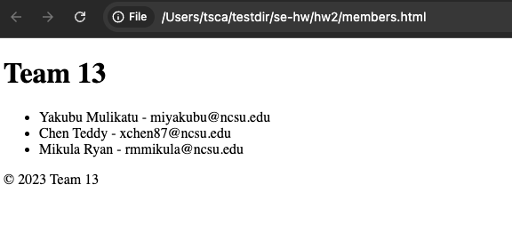

# hw2


## 📝 Introduction

This repository contains the project for Team 13, which includes various tasks and exercises related to Git and version control.



### Code Example

```html
<!DOCTYPE html>
<html lang="en">
<head>
    <meta charset="UTF-8">
    <meta name="viewport" content="width=device-width, initial-scale=1.0">
    <title>Team 13</title>
</head>
<body>
    <h1>Team 13</h1>
    <ul>
        <li>Yakubu Mulikatu - miyakubu@ncsu.edu</li>
        <li>Chen Teddy - xchen87@ncsu.edu</li>
        <li>Mikula Ryan - rmmikula@ncsu.edu</li>
    </ul>
    <footer>
        <p>&copy; 2023 Team 13</p>
    </footer>
</body>
</html>
```

### Task List

- [x] Task 1: Complete Git Tutorial 
- [x] Task 2: Add Screenshots to README.md

teddy task 1


- [x] Task 3: Modify `.html` File  
- [x] Task 4: Merge latest changes  
- [x] Task 5: Review pull requests


an extra line for task 9